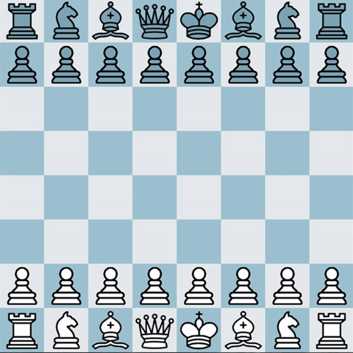
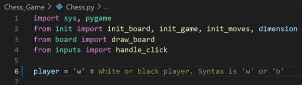

# Chess_Game_PY

This is a chess game built in Python using the Pygame library. It includes standard chess mechanics with an interactive UI



## Features
- Playable chess game with basic chess moves
- Interactive board
- Black and white perspectives available

## Requirements
- Python 3.x
- Pygame
- Numpy

## Setup Instructions:

### 1. Clone the repository
You can clone the repository to your local machine using the following bash command:

`git clone https://github.com/SpencerMAnderson/Chess_Game_PY`

### 2. Setup a Virtual Environment
Navigate to the project directory:

`cd Chess_Game_PY`

**For Windows:**
```
python -m venv venv
venv\Scripts\activate
```

**For macOS/Linux:**
```
python3 -m venv venv
source venv/bin/activate
```

### 3. Install Dependencies
Once the virtual environment is activated, install required dependencies with the following command:

`pip install -r requirements.txt`

### 4. Run the Game
Finally, to run the chess game, navigate to the **Chess_Game_PY** directory and run the following command:

`python Chess_Game/Chess.py`

(To switch player perspectives, you can manually change the _player_ variable in **Chess.py** (line 6) to: 'w' or 'b')



### 5. Deactivate the Virtual Environment
When you're done, you can deactivate the virtual environment with the command:

`deactivate`

## Project Structure
```
Chess_Game_PY/
├── Chess_Game/               # Folder containing game files
│   ├── board.py
│   ├── Chess.py              # Main file to run the game
│   ├── init.py
│   ├── inputs.py
│   ├── Logic.py
│   ├── menu.py
│   ├── resources.py
│   ├── Pieces/               # Folder containing images for pieces
│   ├── sounds/               # Folder containing sound effects
│   └── __pycache__/          # Folder containing compiled Python files
├── GIFs                      # Folder containing GIFs for README.md
├── venv/                     # Virtual environment folder (not tracked by Git)
├── requirements.txt          # File listing the required dependencies
└── README.md                 # This file
```

## Controls
- To move pieces on the board, you first click on the piece you want to move, and then click on the square you want to move to.
- To cancel a move, you can right-click to deselect a piece.

## Future updates
- Currently, there is no logic to handle en passant moves or piece promotion. These will be implemented in future updates to this project.
- I plan on implementing a timer system as well as a menu where players can select time formats.

## License
This project is completely open-source. Feel free to use and modify the code however you like!
